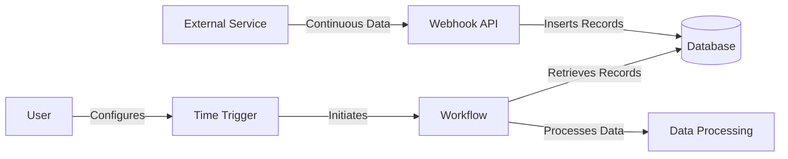
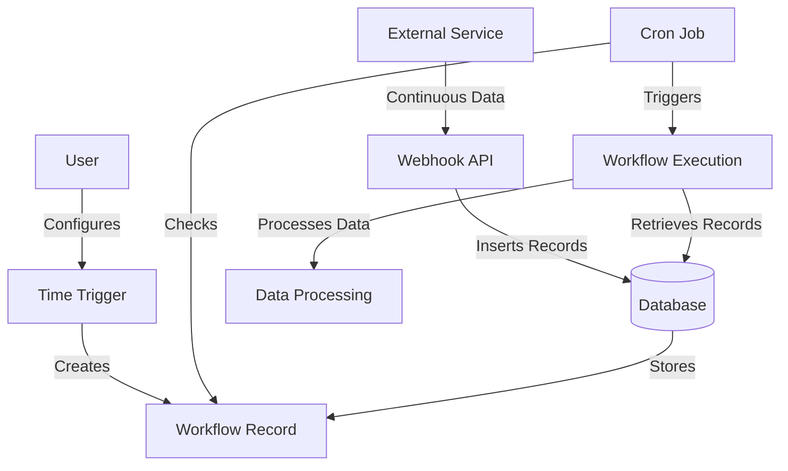
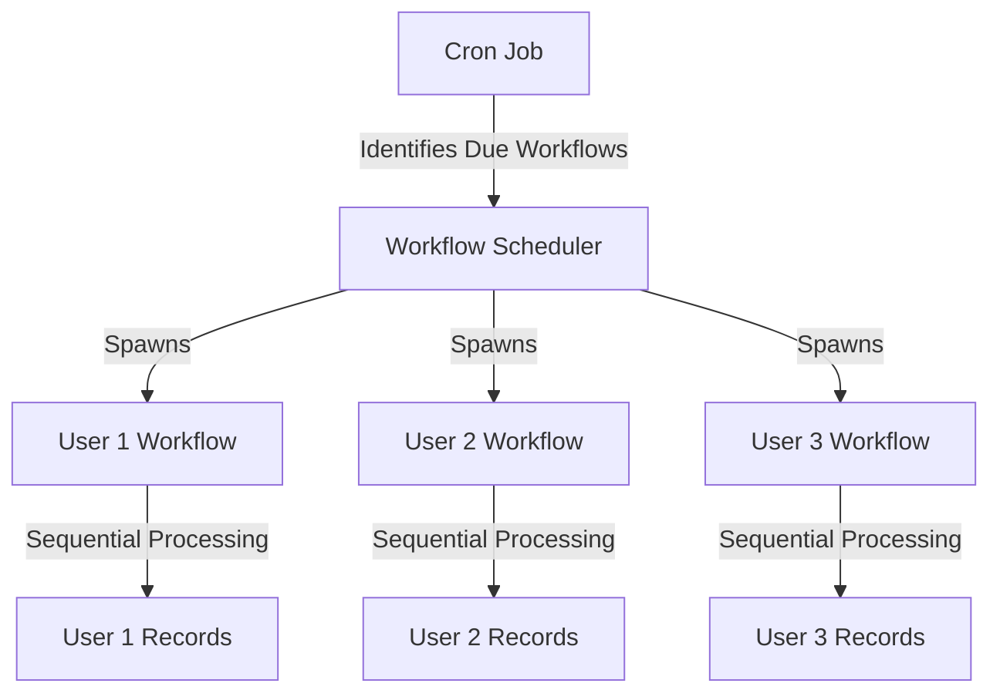
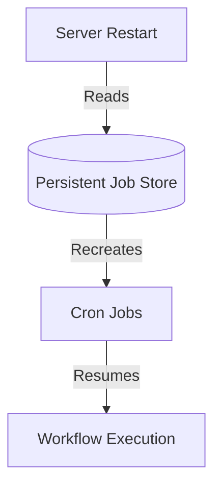

# Cron Job Setup Brainstorm Document

## 1. Introduction

The "Service Connector: Pull" agent is a sophisticated mechanism designed to continuously ingest data from an external service and process it at user-defined intervals. This document provides a detailed explanation of the concept, proposes an implementation approach, and discusses potential challenges and solutions.

## 2. Concept Overview

1. A webhook API (provided by Ravi) continuously pulls data from an external service and inserts records into a database table.
2. Users configure time triggers to initiate workflows at specified intervals.
3. When triggered, each workflow retrieves and processes relevant records from the database.

## 3. Proposed Implementation

### 3.1 Continuous Data Ingestion
- The webhook API continuously pulls data from the external service.
- New records are inserted into a database table with a timestamp.

### 3.2 User Configuration
- User selects a time period (e.g., 30 seconds) for the workflow trigger.
- The workflow is initiated based on this configuration.

### 3.3 Workflow Record Creation
- A new workflow record is created with:
  - User email
  - Associated workflow
  - Workflow starting time

### 3.4 Cron Job Setup
- A cron job runs continuously on the server, checking every second.
- It identifies workflows due to run based on their starting time and user-defined interval.

### 3.5 Workflow Execution
- When a workflow is triggered, it retrieves all records from the table where:
  record_creation_time > workflow_starting_time
- The workflow processes these records sequentially.

## 4. System Architecture

## 5. Challenges and Analysis

### 5.1 Multiple User Handling

**Challenge:** Multiple users may start workflows simultaneously, requiring parallel execution while maintaining sequential processing for each user's records.

**Analysis:** The implementation needs careful design to ensure:
- Parallel execution of workflows for different users
- Sequential processing of records within each user's workflow

**Possible Solution:**

Implement a workflow scheduler that can spawn separate processes or threads for each user's workflow, allowing parallel execution while maintaining sequential processing within each workflow.

### 5.2 Server Restart Resilience

**Challenge:** Server restarts can kill ongoing cron jobs, requiring users to manually restart their workflows.

**Analysis:** This is a valid concern, especially in a startup environment where frequent server restarts may occur.

**Possible Solutions:**

1. **Persistent Job Store:** Use a database to store job configurations and their last execution time. On server restart, recreate jobs based on this persistent store.

2. **Distributed Job Scheduling:** Utilize a distributed job scheduling system like Apache Airflow or Celery, which can maintain job states across server restarts.

3. **Containerization:** Use container orchestration tools like Kubernetes to ensure job continuity even if individual containers restart.

## 6. Additional Considerations

1. **Scalability:** As the number of users and workflows grows, consider implementing a queue-based system to manage workflow triggers efficiently.

2. **Error Handling:** Implement robust error handling and logging to manage API failures or data processing issues.

3. **Rate Limiting:** Consider implementing rate limiting to prevent overwhelming the external service with too many API calls.

4. **Monitoring:** Set up monitoring and alerting for the cron job and workflow executions to quickly identify and respond to issues.

5. **Data Consistency:** Ensure that the system can handle scenarios where the same record might be processed multiple times due to overlapping workflow executions.

6. **Performance Optimization:** As the dataset grows, optimize database queries and consider implementing indexing strategies to maintain quick record retrieval.

## 7. Conclusion

The "Service Connector: Pull" agent provides a robust mechanism for continuous data ingestion and periodic processing. By addressing the challenges of multiple user handling and server restart resilience, and considering additional factors like scalability, error handling, and data consistency, you can create an efficient and reliable system for managing data flows from external services.

This approach allows for flexibility in data processing schedules while maintaining a continuous stream of up-to-date data. As you implement and scale this system, regular performance monitoring and optimization will be key to ensuring its long-term success and efficiency.