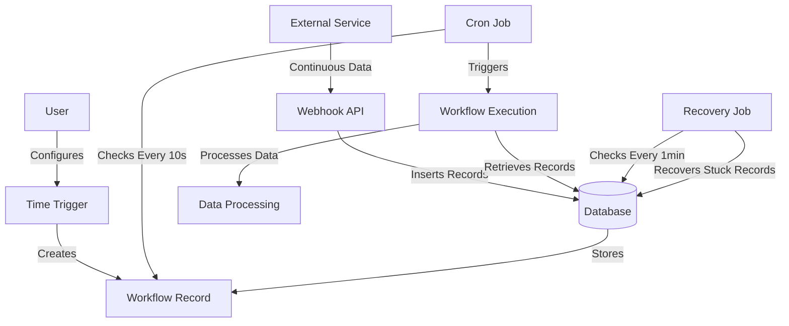
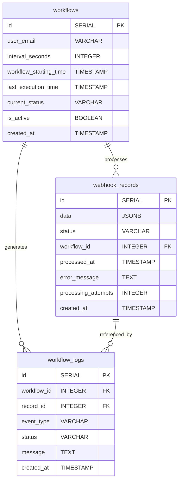
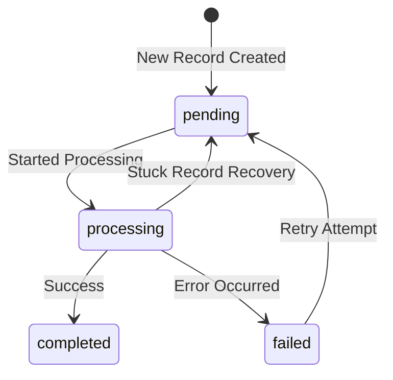
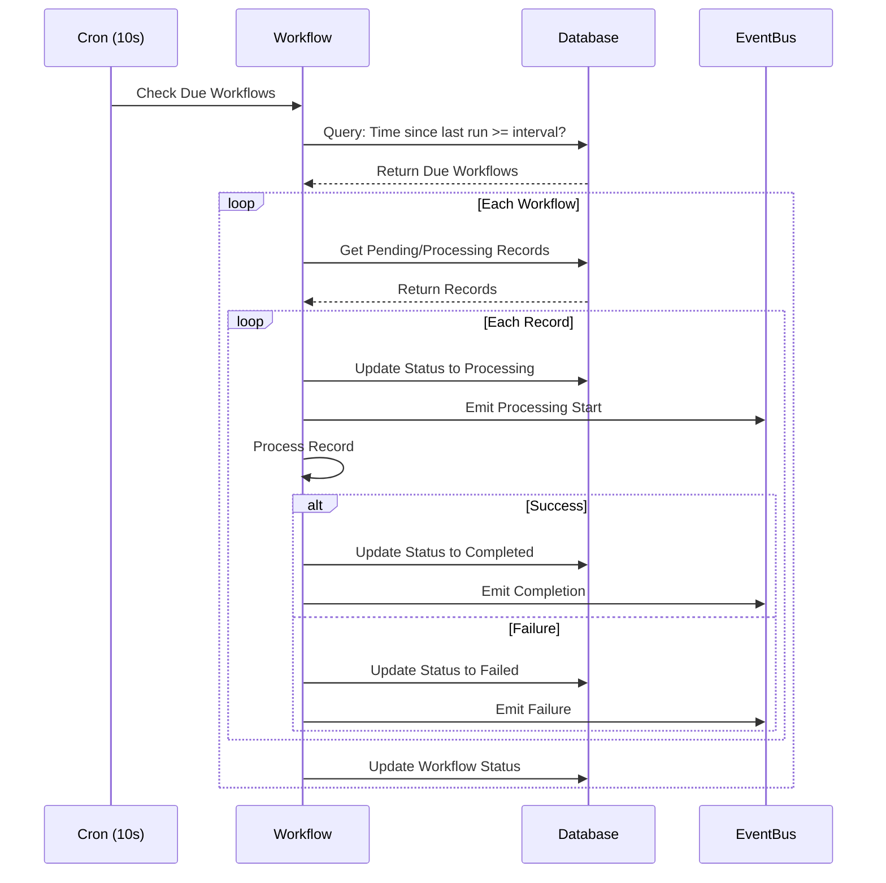
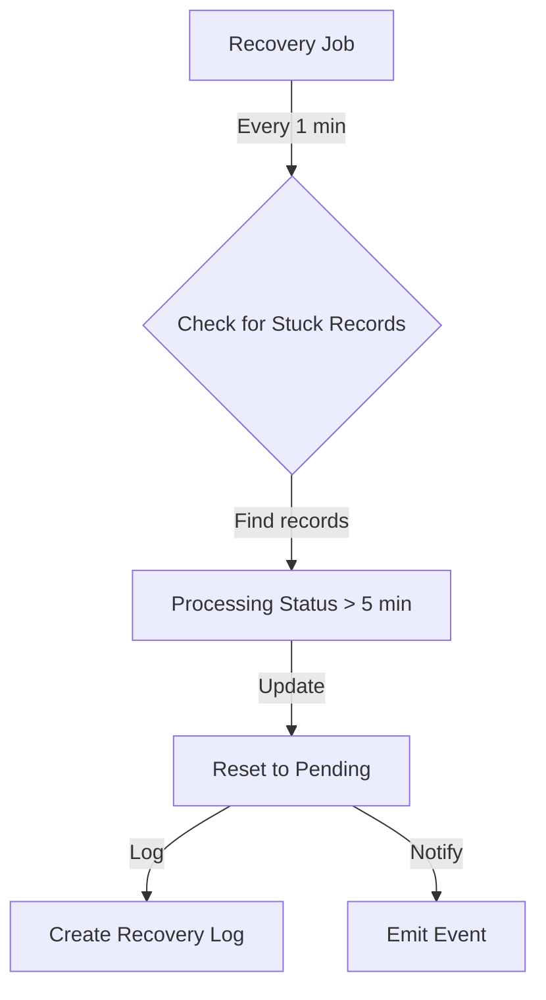
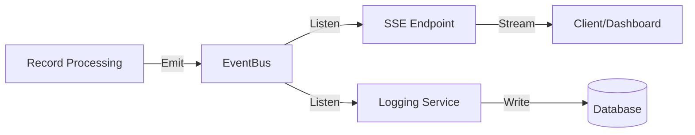

# Cron Job Architecture

## 1. The Big Picture: How Everything Fits Together



**What's Actually Happening Here?**
Imagine you're running an e-commerce platform that needs to process orders from multiple sources. Here's how our system handles this:

1. **Data Ingestion (External Service → Webhook)**
   - Orders continuously come in from different sources (e.g., website, mobile app, third-party marketplaces)
   - The webhook API receives these orders and stores them in the database

2. **Workflow Setup (User → Time Trigger)**
   - You configure how often you want to process these orders (e.g., every 30 seconds)
   - Each configuration creates a workflow record in the database

3. **Processing (Cron Job → Workflow Execution)**
   - Every 10 seconds, the system checks if any workflows are due to run
   - If it's time, it processes the pending orders for that workflow

4. **Safety Net (Recovery Job)**
   - A separate job runs every minute to check for any stuck orders
   - If an order has been "processing" for too long, it gets reset and retried

## 2. How Data is Organized: Database Structure



**Understanding the Data Relationships**

Think of this like a restaurant order system:

1. **Workflows (The Kitchen Schedule)**
   - Each workflow is like a kitchen shift
   - It defines when to check for new orders (`interval_seconds`)
   - Tracks when it last processed orders (`last_execution_time`)
   - Example record:
     ```json
     {
       "id": 1,
       "user_email": "kitchen@restaurant.com",
       "interval_seconds": 30,
       "current_status": "running"
     }
     ```

2. **Webhook Records (The Orders)**
   - Each record is like an individual order
   - Contains the actual order data (`data`)
   - Shows its current status (`pending`, `processing`, `completed`, `failed`)
   - Example record:
     ```json
     {
       "id": 101,
       "data": {
         "order_id": "12345",
         "items": ["Pizza", "Soda"],
         "total": 25.99
       },
       "status": "pending"
     }
     ```

3. **Workflow Logs (The Order History)**
   - Like a detailed log of everything happening to each order
   - Records when orders are received, processed, completed, or failed
   - Helps track issues when something goes wrong
   - Example record:
     ```json
     {
       "id": 501,
       "workflow_id": 1,
       "record_id": 101,
       "event_type": "record_processing",
       "message": "Started processing order #12345"
     }
     ```

## 3. How Records Move Through the System



**The Life of a Record**

Let's follow an order through the system:

1. **New → Pending**
   - A new order comes in through the webhook
   - Gets stored with status "pending"
   - Waits for next workflow execution

2. **Pending → Processing**
   - Workflow picks up the order
   - Status changes to "processing"
   - System starts handling the order

3. **Processing → Completed/Failed**
   - If successful: status changes to "completed"
   - If error occurs: status changes to "failed"
   - All steps are logged in workflow_logs

4. **Recovery Process**
   - If an order is stuck in "processing" for > 5 minutes
   - Recovery job finds it and resets to "pending"
   - Gets another chance to be processed

Example Scenario:
```javascript
// 1. New order comes in
const newOrder = {
  order_id: "12345",
  amount: 99.99,
  customer: "John Doe"
};

// 2. Stored as pending record
// Status: pending
{
  id: 1,
  data: newOrder,
  status: "pending",
  created_at: "2024-01-23 10:00:00"
}

// 3. Processing starts
// Status: processing
{
  id: 1,
  data: newOrder,
  status: "processing",
  workflow_id: 1,
  processing_attempts: 1
}

// 4. Successfully completed
// Status: completed
{
  id: 1,
  data: newOrder,
  status: "completed",
  processed_at: "2024-01-23 10:00:05"
}
```

## 4. Time-Based Processing: When Things Happen



**Real-World Example: Order Processing System**

Let's say you have three different workflows:
1. Regular orders (every 30 seconds)
2. Priority orders (every 10 seconds)
3. Bulk orders (every 5 minutes)

Here's what happens:

1. **Every 10 Seconds (Cron Check)**
   ```javascript
   // The system checks which workflows are due
   const dueWorkflows = await getWorkflows(`
     SELECT * FROM workflows
     WHERE is_active = true
     AND (
       last_execution_time IS NULL OR
       EXTRACT(EPOCH FROM (CURRENT_TIMESTAMP - last_execution_time)) >= interval_seconds
     )
   `);
   // At 10:00:00, might return Priority Orders workflow
   // At 10:00:30, might return Regular Orders workflow
   // At 10:05:00, might return all three workflows
   ```

2. **For Each Due Workflow**
   ```javascript
   // Get pending records for this workflow
   const records = await getRecords(`
     SELECT * FROM webhook_records
     WHERE status = 'pending'
     AND created_at > $1
     ORDER BY created_at ASC
   `, [workflow.starting_time]);
   ```

## 5. Recovery System: Handling Problems



**When Things Go Wrong**

Consider these scenarios:

1. **Server Crash During Processing**
   - Order #1234 was being processed
   - Server crashed
   - Record stuck in "processing" state

2. **Network Timeout**
   - Order #5678 processing started
   - External API timeout
   - Record stuck in "processing" state

Here's how recovery works:

```javascript
// Recovery job runs every minute
async function recoverStuckRecords() {
  // Find stuck records
  const stuckRecords = await db.query(`
    SELECT * FROM webhook_records
    WHERE status = 'processing'
    AND processed_at < NOW() - INTERVAL '5 minutes'
  `);

  for (const record of stuckRecords) {
    // Reset to pending
    await db.query(`
      UPDATE webhook_records
      SET status = 'pending',
          error_message = 'Recovered from stuck state',
          processing_attempts = processing_attempts + 1
      WHERE id = $1
    `, [record.id]);

    // Log recovery
    await createLog({
      workflow_id: record.workflow_id,
      record_id: record.id,
      event_type: 'record_recovered',
      message: `Record ${record.id} recovered from stuck state`
    });
  }
}
```

## 6. Real-Time Monitoring: Watching It All Happen



**Practical Monitoring Example**

1. **Dashboard View**
```javascript
// React component showing real-time status
function WorkflowMonitor({ workflowId }) {
  const [stats, setStats] = useState({
    pending: 0,
    processing: 0,
    completed: 0,
    failed: 0
  });

  useEffect(() => {
    const events = new EventSource('/status-updates');
    
    events.onmessage = (event) => {
      const update = JSON.parse(event.data);
      if (update.workflowId === workflowId) {
        setStats(prev => ({
          ...prev,
          [update.status]: prev[update.status] + 1
        }));
      }
    };

    return () => events.close();
  }, [workflowId]);

  return (
    <div className="monitor">
      <div>Pending: {stats.pending}</div>
      <div>Processing: {stats.processing}</div>
      <div>Completed: {stats.completed}</div>
      <div>Failed: {stats.failed}</div>
    </div>
  );
}
```

2. **Common Monitoring Queries**
```sql
-- Get current workflow status
SELECT 
    w.id,
    w.current_status,
    COUNT(CASE WHEN wr.status = 'pending' THEN 1 END) as pending,
    COUNT(CASE WHEN wr.status = 'processing' THEN 1 END) as processing,
    COUNT(CASE WHEN wr.status = 'completed' THEN 1 END) as completed,
    COUNT(CASE WHEN wr.status = 'failed' THEN 1 END) as failed
FROM workflows w
LEFT JOIN webhook_records wr ON wr.workflow_id = w.id
WHERE w.id = 1
GROUP BY w.id, w.current_status;

-- Get recent errors
SELECT 
    wr.id,
    wr.error_message,
    wr.processing_attempts,
    wl.created_at as error_time
FROM webhook_records wr
JOIN workflow_logs wl ON wl.record_id = wr.id
WHERE wr.status = 'failed'
AND wl.event_type = 'record_failed'
ORDER BY wl.created_at DESC
LIMIT 10;
```

## 7. Common Implementation Scenarios

1. **Setting Up a New Workflow**
```javascript
// Create workflow for processing high-priority orders
await db.query(`
  INSERT INTO workflows (
    user_email,
    interval_seconds,
    workflow_starting_time,
    current_status,
    is_active
  ) VALUES (
    'orders@company.com',
    10,  -- Process every 10 seconds
    CURRENT_TIMESTAMP,
    'initialized',
    true
  )
`);
```

2. **Handling Retries**
```javascript
// Retry failed records with exponential backoff
const retryDelays = [1, 5, 15, 30]; // minutes

async function retryFailedRecords() {
  const failedRecords = await db.query(`
    SELECT * FROM webhook_records
    WHERE status = 'failed'
    AND processing_attempts < 4
    AND processed_at < NOW() - INTERVAL '$1 minutes'
  `, [retryDelays[processing_attempts]]);

  for (const record of failedRecords) {
    await db.query(`
      UPDATE webhook_records
      SET status = 'pending',
          error_message = NULL
      WHERE id = $1
    `, [record.id]);
  }
}
```